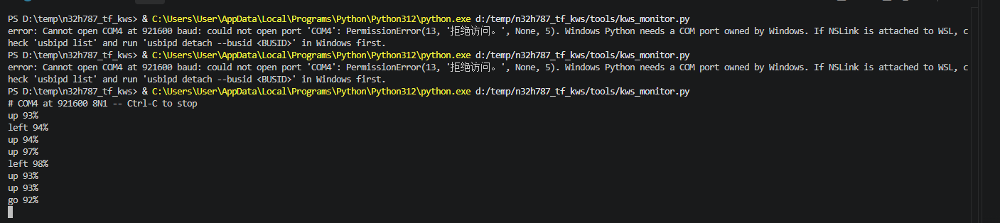

# N32H787 离线语音关键词识别 DEMO

基于 N32H787 MCU 与板载 WM8978 音频编解码器，在端侧运行 TensorFlow Lite Micro 的 DS-CNN_S 语音关键词模型（KWS, Keyword Spotting），**完全离线**识别 10 个英文命令词并通过串口与指示灯实时输出结果的模板工程。

## 简介

本工程是一个低延迟的离线命令词识别模板：M7 内核通过 I2S + DMA 持续采集麦克风音频，每 60 ms 完成一次"音频取块 → MFCC 特征 → 神经网络推理 → 多帧平均判决"，识别到 `yes / no / up / down / left / right / on / off / stop / go` 时在串口打印一行 `关键词 置信度%` 并点亮指示灯。全程不依赖网络或云端，模型与推理全部在片内 SRAM 中完成，适合作为语音唤醒、声控开关、语音菜单等应用的起点。

## 硬件平台

- **MCU**：N32H787（Cortex-M7 @ 600 MHz，带双精度 FPU）。本应用为**单核 M7 工程**，M4 在调试配置中保持复位
- **开发板**：国民技术官方开发板 **N32H787_HMI_V1.1**（实测芯片型号 N32H787XIB7）
- **音频**：板载 WM8978 编解码器 + 驻极体麦克风
  - WM8978 为 **I2S 主机**（MCLK/BCLK/LRCK 由编解码器产生），MCU 的 I2S1 作从机接收，16 kHz、单声道（取左声道）、int16
  - 控制接口为 **I2C4**（PD12=SCL / PD13=SDA）
  - I2S1 接收经 **DMA1 通道 0 + DMAMUX1** 以循环链表方式写入环形缓冲
- **调试/串口**：板载 **NSLink**（USB 复合设备：CMSIS-DAP 调试器 + USB 虚拟串口，USART1 / PA9 / PA10，**921600 8N1**）
- **指示灯**：
  - **PB3 红灯**：识别到关键词时低电平点亮 **1 秒**（active-low）
  - **PI8**：每 500 ms 翻转一次的运行心跳灯
- **Flash 布局**：本工程为独立（standalone）镜像，向量表与应用从片内 Flash 基址 **`0x15000000`** 开始，上电直接启动，不依赖 USB-MSC Bootloader

## 功能（关键词识别实现流程）

从声音到识别结果按以下流水线实现（与 Arm ML-KWS-for-MCU 参考实现一致）：

1. **采集**：WM8978 输出 16 kHz I2S 流，DMA 以 8 块环形缓冲连续搬运，每个 DMA 块恰好是一轮应用所需的 60 ms 音频（960 采样）。
2. **分帧**：每轮取一块音频，按帧移 320 采样（20 ms）、窗长 640 采样（40 ms）计算 3 帧 MFCC；Hann 窗 + 1024 点 FFT + 40 个 mel 滤波器（20 Hz–4 kHz）+ 10 个 DCT-II 系数，得到 10 维特征。
3. **特征窗**：49×10 的特征环形缓冲左移 3 帧。开机后前约 1 秒（缓冲未填满）不推理，避免冷启动误报。
4. **推理**：TensorFlow Lite Micro 在 M7 上执行 **DS-CNN_S float32** 网络，输出 12 类 Softmax 分值。模型权重由启动代码从 Flash 加载副本拷贝到 **DTCM**，应用主体代码运行在 **ITCM**。
5. **判决与输出**：对最近 3 轮输出求平均，平均置信度 **> 90%** 且通过去抖（同一词只在回到静音后重新武装）才上报：串口打印如 `yes 92%`，同时 PB3 亮 1 秒。`silence` 与 `unknown` 两类不播报、不点灯。

## 目录结构

```
n32h787_kws_demo/
├── firmware/
│   ├── USER/                    # KWS 应用代码
│   │   ├── inc/                 #   应用头文件
│   │   ├── src/
│   │   │   ├── main.c           #   M7 入口：时钟/缓存/编解码器初始化与主循环
│   │   │   ├── kws_app.c        #   轮次调度、多帧平均、阈值去抖、LED/串口输出
│   │   │   ├── kws_audio.c      #   I2S1 + DMA1 环形采集（8 块 × 60 ms）
│   │   │   ├── kws_mfcc.c       #   MFCC 前端（Hann/FFT/mel/DCT）
│   │   │   ├── kws_classifier.cc#   TFLM 解释器封装与算子注册
│   │   │   ├── kws_model_data.cc#   由 .tflite 构建时自动生成（不入库）
│   │   │   ├── wm8978.c/.h      #   WM8978 寄存器配置（I2C4 + I2S）
│   │   │   └── n32h7xx_cfg.c    #   时钟/GPIO/I2C/I2S/DMA/USART 配置
│   │   └── tflm_sdk/            #   TFLM 头文件、预编译库、音频 signal 库与第三方组件
│   ├── Driver/                  # CMSIS 核头/启动文件/设备文件、标准外设驱动
│   ├── Makefile/
│   │   ├── Makefile             #   GNU Make 构建脚本
│   │   ├── build.cmd            #   Windows 一键构建/烧录入口
│   │   ├── flash.cmd            #   不经 make/sh 直接烧录已编译 bin
│   │   └── LinkFile/            #   应用链接脚本（ITCM/DTCM/Flash 分区）
│   └── openocd/                 # NSLink/CMSIS-DAP 烧录配置与 Flash 算法（含 README）
├── models/
│   └── DS_CNN_S.tflite          # DS_CNN_S 关键词模型（float32，约 95 KiB）
├── tools/
│   ├── host/                    # 主机端构建工具：内置 BusyBox（免装 Git for Windows）
│   ├── kws_monitor.py           # 串口识别结果监视器
│   ├── serial_port.py           # NSLink 串口自动发现（VID/PID）
│   ├── embed_tflite.py          # 把 .tflite 转成 C++ 数组（构建自动调用）
│   ├── winusb/                  # NSLink CMSIS-DAP 的 WinUSB 驱动安装文件
│   └── tests/                   # 主机侧单元测试（pytest）
├── docs/
│   └── KWS_DEPLOYMENT.md        # 详细设计与部署说明（内存布局/数据路径/调参）
├── LICENSE                      # Apache License 2.0
├── NOTICE                       # 第三方组件归属与许可
└── README.md
```

## AI 模型说明

- **模型**：DS_CNN_S（Depthwise-Separable CNN，Small），来自 Arm 开源参考工程 **ML-KWS-for-MCU** 的预训练模型，与 `Pretrained_models/DS_CNN/DS_CNN_S.tflite` 逐字节相同，训练集为 **Google Speech Commands v0.02**。文件见 [DS_CNN_S.tflite](models/DS_CNN_S.tflite)（95,480 字节）。
- **类别**：12 类，输出顺序为 `silence、unknown、yes、no、up、down、left、right、on、off、stop、go`；实际播报后 10 个命令词。
- **数据类型**：**float32**（无量化），输入张量 `fingerprint_input [1,490]`（即 49 帧 × 10 个 MFCC 系数），输出 `labels_softmax [1,12]`（已过 Softmax）。
- **算子**：RESHAPE ×1、CONV_2D ×4、DEPTHWISE_CONV_2D ×5、AVERAGE_POOL_2D ×1、FULLY_CONNECTED ×1、SOFTMAX ×1；Tensor arena 预留 128 KiB。
- **性能量级**：约 0.5 M MAC/次推理，60 ms 轮次周期内完成"采集 + MFCC + 推理 + 判决"（M7 @ 600 MHz，代码在 ITCM、权重在 DTCM）。
- **换模型**：替换 `models/DS_CNN_S.tflite` 后重新构建即自动重新生成模型数组；若输入尺寸、类别数或量化方式不同，需同步修改 [kws_classifier.cc](firmware/USER/src/kws_classifier.cc)（输入形状/算子注册）、[kws_app.c](firmware/USER/src/kws_app.c)（类别表/阈值）与 [kws_mfcc.c](firmware/USER/src/kws_mfcc.c)（前端参数）。

## 环境依赖

- **工具链**：**N32Studio**（自带 ARM GCC `arm-none-eabi-`、GNU Make 与 OpenOCD，默认安装在 `%USERPROFILE%\.n32studio`）。[build.cmd](firmware/Makefile/build.cmd) 会自动定位上述工具，无需修改系统 PATH；也可用 `GCC_PATH` / `OPENOCD` 环境变量指定其它安装位置
- **不需要安装 Git**：Makefile 的规则需要一个 POSIX shell（sh/rm/mkdir/awk），但本工程在 [tools/host/](tools/host/) 内附带了 BusyBox 单文件（GPL-2.0，归属见 [NOTICE](NOTICE)），build.cmd 首次运行时自动在 `tools\host\.shim` 生成 shim（该目录不入库、可随时删除）。机器上若已装 Git for Windows 或已设置 `SH_DIR`，也会被自动识别使用；直接在 Git Bash/MSYS2 中运行 `make` 同样兼容
- **Python**：3.10+（构建时仅使用标准库；串口监视器另需 pyserial）
- **NSLink 驱动**：首次使用时 OpenOCD 需要 NSLink 的 CMSIS-DAP 接口绑定 WinUSB 驱动，安装文件与脚本见 [tools/winusb/](tools/winusb/)（N32Studio 通常已自动完成绑定）

```bat
pip install pyserial
```

## 编译/构建/烧录方式（Windows）

在 `firmware\Makefile` 目录下执行：

```bat
build.cmd              :: 构建，产出 build\n32h787_kws_demo.elf/.hex/.bin
build.cmd release=y    :: 无调试信息的 release 构建
build.cmd clean        :: 清理 build 目录
build.cmd flash        :: 构建并经 NSLink 烧录到 0x15000000
build.cmd rebuild      :: 清理后重新构建
build.cmd reflash      :: 清理 + 构建 + 烧录
flash.cmd              :: 不经过 make/sh，直接烧录 build 目录下已编好的 bin（仅需 N32Studio）
flash.cmd path\to.bin  :: 烧录指定 bin
```

在 Git Bash / MSYS2 中也可以直接使用 make（此时使用其自带的 /bin/sh）：

```bat
make -j4 PYTHON=python
make flash PYTHON=python OPENOCD=C:/path/to/openocd.exe
make probe PYTHON=python
```

说明：

- 烧录从 **Flash 基址 `0x15000000`** 起写入完整独立镜像（含向量表），上电直接启动，无需 Bootloader 跳转。
- 烧录前 OpenOCD 脚本会自动检查并配置芯片 TCM 内存分区（256 KiB ITCM + 512 KiB DTCM），首次烧录会触发一次芯片自复位，属正常现象。
- SWD 接线、Flash 算法与常见问题详见 [firmware/openocd/README.md](firmware/openocd/README.md)。

## 串口使用（查看识别结果）

NSLink 枚举为虚拟串口后（按 USB VID/PID `19F5:3106` 自动识别 COM 口，无需手动指定）：

```bat
python tools\kws_monitor.py                 :: 持续监听，Ctrl-C 退出
python tools\kws_monitor.py --seconds 30    :: 监听 30 秒后退出
python tools\kws_monitor.py --list-ports    :: 查看可用串口
python tools\kws_monitor.py --log kws.txt   :: 同时把结果追加保存到文件
```

上电后固件先打印一行类别横幅，之后每识别到一个词打印一行：

```text
kws: ds-cnn-s float32, 16 kHz, classes: silence unknown yes no up down left right on off stop go
yes 92%
stop 95%
```

实测效果（对着板载麦克风说出命令词，串口实时打印识别结果与置信度）：



注意事项：

- 波特率固定 **921600 8N1**，与监视器不一致时链路**静默无输出**（不是乱码），先查波特率。
- 想看开机横幅：先启动监视器，再按复位键或重新上电。
- 上电后约 1 秒为冷启动缓冲填充期，期间不推理，属正常设计。
- 串口监视器与 OpenOCD 烧录可同时使用（NSLink 的调试接口与串口接口相互独立），烧录复位后监视器会继续打印新固件的横幅。

## 单元测试

主机侧（无需开发板）的逻辑测试位于 [tools/tests/](tools/tests/)：

```bat
pip install pytest
python -m pytest tools\tests -q
```

其中 LED 极性/定时、音频 DMA 中断等用例会调用本机 C 编译器（`cc`）编译临时代码，Windows 上未安装 MinGW/GCC 时这些用例会报错跳过，不影响固件本身。

## 开源许可

本工程由国民技术股份有限公司（Nations Technologies Inc.）以 **Apache License 2.0** 发布，完整许可文本见 [LICENSE](LICENSE)。自有源文件头均带有 `SPDX-License-Identifier: Apache-2.0` 声明。

- 第三方组件（ARM CMSIS、TensorFlow Lite Micro、ML-KWS-for-MCU 的模型与 MFCC 前端、CMSIS-NN、FlatBuffers、gemmlowp、ruy、KissFFT 及 NSLink Flash 算法）的归属与许可见 [NOTICE](NOTICE)，各自许可文本随附在对应源码目录中（如 `firmware/USER/tflm_sdk/LICENSE`、KissFFT 的 `COPYING`），再分发时请一并保留。
- **特别注意**：[firmware/USER/src/wm8978.c](firmware/USER/src/wm8978.c) 与 [wm8978.h](firmware/USER/inc/wm8978.h) 移植自 Linux 内核的 WM8978 驱动，保留其文件头声明的 **GPL-2.0-only** 许可，不受本工程 Apache-2.0 许可覆盖；若需以纯 Apache-2.0 形式分发，请自行替换为独立编写的编解码器配置代码。
- **商标声明**：Nations、Nationstech、N32、N32H787 及国民技术标识为国民技术股份有限公司商标，Apache-2.0 许可不包含商标授权。
